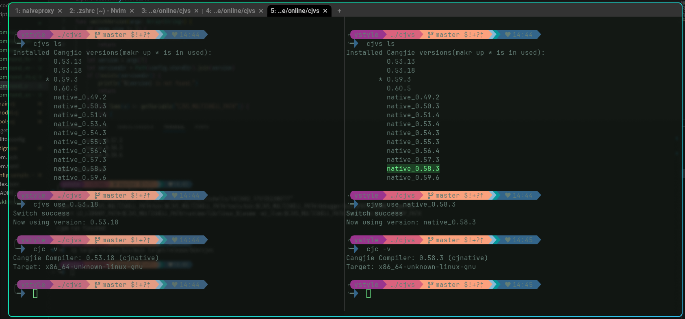

### cjvs
仓颉版本管理工具，类似nvm，目前支持linux、macos、windows平台. linux解压依赖tar和unzip

更新日志:
> - 2025-12-30 v0.3.0 升级到 Cangjie 1.0.0，新增 stdx 管理功能，支持静态/动态库切换，支持 macOS 平台
> - 2025-08-24 windows 也能使用了， 并新增了`elvish`和`nushell`的支持
> - 2025-07-04 因为添加了不同的shell进程，可切换不同版本的功能，当前widnows 版本暂时不可用
> - 2025-03-30 初步支持了windows(powershell), 可以自己手工编译试用


已知问题:
- **zip4cj CANGJIE_STDX_PATH 格式不兼容**：
  - zip4cj 使用旧格式：`CANGJIE_STDX_PATH=/target` + `path-option = ["${CANGJIE_STDX_PATH}/linux_x86_64_llvm/dynamic/stdx"]`
  - 新格式为：`CANGJIE_STDX_PATH=/target/linux_x86_64_llvm/dynamic/stdx` + `path-option = ["${CANGJIE_STDX_PATH}"]`
  - **问题**：两种格式的 CANGJIE_STDX_PATH 值不同，无法同时满足。如果使用旧格式会导致所有依赖都链接到动态库（.so）
  - **解决方案**：必须使用本地 path 依赖并手动修改 zip4cj：
    ```bash
    # 1. Clone zip4cj 到本地
    cd ~/Code/Cangjie
    git clone https://gitcode.com/Cangjie-TPC/zip4cj.git

    # 2. 修改 zip4cj/cjpm.toml
    [package]
      output-type = "static"  # 改为静态库

    [target.x86_64-unknown-linux-gnu.bin-dependencies]
      path-option = [ "${CANGJIE_STDX_PATH}" ]  # 使用新格式

    # 3. cjpm.toml 中使用本地依赖
    [dependencies]
    zip4cj = { path = "../zip4cj/", output-type = "static"}
    ```
- 0.1.1 版本， 如果切换到0.59及以下版本需要设置`export CANGJIE_HOME=$CJVS_MULTISHELL_PATH`, 因为std外的包(如net/encoding待是从CANGJIE_HOME环境变量导入的)

### 功能
- 列出可在线安装的官方发布版本
- 在线安装官方发布版本
- 离线安装zip/tar.gz版本(需要按官方的目录结构，可离线安装内测版本)
- 列出已安装的版本
- 在每个shell/或者终端模拟器页签中切换并使用不同的仓颉版本
- 设置默认的仓颉版本
- 删除cjvs安装的版本
- **管理 stdx 扩展库**：安装、切换、删除 stdx 版本，支持静态/动态库切换

### 安装
- 先克隆仓库: `git clone https://github.com/ystyle/cjvs`  
- 需要安装stdx, 然后设置环境变量: `export CANGJIE_STDX_PATH=path_to_stdx/1.0.0/`
- 使用1.0.0版本的仓颉编译: `cjpm build`
- 如果使用`Archlinux`可以使用`paru -S cjvs-bin`安装
  >本仓库Release里的linux-amd64版本是在archlinux构建的，在较老的linux发行版可能不支持。

### 设置

#### Linux
>linux下默认会安装仓颉版本到`~/.config/cjvs`目录

需要安装[OpenSsl](https://cangjie-lang.cn/docs?url=%2F0.53.18%2Fuser_manual%2Fsource_zh_cn%2FAppendix%2Flinux_toolchain_install.html) ，仓颉网络库依赖openssl

1. 手动安装时需要把cjvs放path环境变量里
  ```shell
  export PATH=$PATH:/path/to/cjvs
  ```
2. 添加shell配置，按使用的bash或zsh添加以下配置
  ```shell
  # zsh
  eval "$(cjvs env zsh)"

  # bash
  eval "$(cjvs env bash)"
 
  # nushell： 这两行
  cjvs env nushell | save -f ~/.cjvs.nu
  use ~/.cjvs.nu
 
  # elvish 
  eval (cjvs.exe env elvish | slurp)
  ```


#### Windows
- 编译安装好后，把以下文件放到一个目录，并添加到Path环境变量
  - `cjvs.exe`
  - `libcangjie-runtime.dll`: 来自`$CANGJIE_HOME\runtime\lib\windows_x86_64_llvm\libcangjie-runtime.dll`
  - `libsecurec.dll`: 来自`$CANGJIE_HOME\runtime\lib\windows_x86_64_llvm\libsecurec.dll`
- 找到并打开自己的 PowerShell 启动脚本, 可以执行`$PSVersionTable.PSVersion`查看版本
  - PowerShell 5： `%userprofile%\Documents\WindowsPowerShell\Microsoft.PowerShell_profile.ps1`
  - PowerShell 6/7：`%userprofile%\Documents\PowerShell\Microsoft.PowerShell_profile.ps1`
- 并添加以下内容(创建软件连接需要管理员权限，所以配置成只在有管理员权限时才加载cjvs提供的环境)：
```powershell
# 仅在管理员会话里加载 cjvs
if ([Security.Principal.WindowsPrincipal]::new(
        [Security.Principal.WindowsIdentity]::GetCurrent()
    ).IsInRole([Security.Principal.WindowsBuiltInRole]::Administrator)
) {
    cjvs.exe env powershell | Out-String | Invoke-Expression
}
```
- 以管理员身份启动, 可以正常执行cjvs命令了， 如`cjvs.exe install 1.0.0`

##### 在`非管理员 PowerShell` 使用
- 需要在【设置 - 更新和安全 - 开发者选项 - 开发人员模式】启用， 然后重启系统， 然后在上述文件添加的内容改成只要最后一行添加`cjvs.exe env powershell | Out-String | Invoke-Expression`  
- 如果还提示需要管理员权限， 在【secpol.msc → 本地策略 → 用户权限分配 → 创建符号链接 】添加当前登录用户，再重启系统试试。  
- 如果都不行，就只能回退到上小节，只在管理员会话里加载使用了。

### 使用
```shell
$ cjvs
Usage: cjvs [options...]
  list, ls        List Cangjie installations.
  ls-remote, rls  List all remote Cangjie versions.
  install, i      Install a new Cangjie version.
                    eg:
                      cjvs install 0.53.13 # install online
                      cjvs install 0.59.6 ~/Downloads/cangjie-0.59.6-linux_x64.tar.gz # install a local version
  switch, use     Switch to use the specified version.
  default         Set the default Cangjie version.
  remove, rm      Remove a specific version.
  env             Print and set up required environment variables for cjvs
  stdx            Manage stdx (extension library) versions.
                    eg:
                      cjvs stdx list                              # List installed stdx versions
                      cjvs stdx install 1.0.0 ~/Downloads/stdx.zip # Install stdx from local zip
                      cjvs stdx use 1.0.0                          # Switch stdx version
                      cjvs stdx use 1.0.0 static                   # Switch with static library
                      cjvs stdx default 1.0.0                      # Set default stdx version
                      cjvs stdx default 1.0.0 dynamic              # Set default with dynamic library
                      cjvs stdx config static                      # Set default library type
                      cjvs stdx remove 1.0.0                       # Remove stdx version

GLOBAL OPTIONS:
  --help, -h     show help
  --version, -v  print the version
```

示例
- 显示可用公测版本
  ```shell
  $ cjvs rls            
  Channel: beta
        0.53.13
        0.53.18
  ```
- 在线安装版本，第一次安装的版本会被设置为默认版本
  ```shell
  $ cjvs install 0.53.13
  installing 0.53.13...
  installed.
  0.53.13 is set as default.
  ```
- 安装本地压缩版本（zip/tar.gz的目录结构需要和官方提供的一致）
  ```shell
  $ cjvs install 0.59.6 ~/Downloads/cangjie-0.59.6-linux_x64.tar.gz
  installing 0.59.6...
  installed.
  ```
- 设置启动shell时默认的版本
  ```shell
  $ cjvs default 0.53.13
  ```
- 显示本地已经安装的仓颉版本
    ```shell
    $ cjvs ls
    Installed Cangjie versions(makr up * is in used):
    	  std_0.31.4
    	  jet_0.33.3
    	  std_0.32.5
    	* std_0.33.3
    ``` 
- 切换版本, 可以切换当前shell进程(或终端模拟器的页签)的仓颉版本，每个shell进程可以有不同的版本。
    ```shell
    $ cjvs switch std_0.33.3
    Switch success
    Now using version: std_0.33.3
    ```
    
- 手动添加版本: 
  - 把仓颉编译器版本复制到`$HOME/.config/cjvs/store`目录
    - 如 `$HOME/.config/cjvs/store/std_0.33.3`， 该目录直接包含`bin、lib、runtime、tools、modules`等目录 
    ```shell
    ~/.config/cjvs$ tree -L 3
    .
    └── store
        └── cangjie_0.33.3
            ├── bin
            ├── debugger
            ├── docs
            ├── envsetup.sh
            ├── lib
            ├── modules
            ├── runtime
            ├── third_party
            └── tools

    10 directories, 1 file
    ```

### stdx 管理

stdx 是仓颉的扩展库，包含预编译的静态库和动态库。cjvs 提供了完整的 stdx 管理功能。

#### stdx 命令

```shell
$ cjvs stdx
Usage: cjvs stdx <list|install|use|default|config|remove> [args]

子命令:
  list, ls              列出已安装的 stdx 版本
  install, i <version> <zip-file>  安装 stdx 版本（从本地 zip 文件）
  use <version> [static|dynamic]   切换当前使用的 stdx 版本
  default <version> [static|dynamic] 设置默认 stdx 版本
  config <static|dynamic>          设置默认库类型
  remove, rm <version>             删除 stdx 版本
```

#### stdx 使用示例

```shell
# 安装 stdx（从本地 zip 文件）
$ cjvs stdx install 1.0.0 ~/Downloads/stdx-1.0.0.zip

# 列出已安装的 stdx 版本
$ cjvs stdx ls

# 设置默认版本为 1.0.0，使用动态库
$ cjvs stdx default 1.0.0

# 设置默认版本为 1.0.0，使用静态库
$ cjvs stdx default 1.0.0 static

# 切换当前版本为 1.0.0，使用动态库
$ cjvs stdx use 1.0.0

# 只修改默认库类型为 static（不改变版本）
$ cjvs stdx config static

# 删除指定版本
$ cjvs stdx remove 0.9.0
```

#### 在环境中启用 stdx

使用 `-stdx` 参数启用 stdx 环境变量：

```shell
# bash/zsh
eval "$(cjvs env bash -stdx)"

# nushell
cjvs env nushell -stdx | save -f ~/.cjvs.nu
use ~/.cjvs.nu

# elvish
eval (cjvs env elvish -stdx | slurp)
```

这会设置 `CANGJIE_STDX_PATH` 环境变量，指向当前选择的 stdx 版本和库类型（static/dynamic）。

**注意**：`-stdx` 方式使用符号链接，当前版本的 cjpm 尚不支持读取符号链接，可能导致编译问题。建议使用下面的 `stdx-env` 命令。

#### 使用 stdx-env 命令（推荐）

`stdx-env` 命令专门用于设置 stdx 环境变量，直接使用实际路径，不依赖符号链接：

```shell
# bash/zsh
eval "$(cjvs stdx-env zsh)"
eval "$(cjvs stdx-env bash)"

# 或使用子命令形式
eval "$(cjvs stdx env zsh)"

# nushell
cjvs stdx-env nushell | save -f ~/.cjvs-stdx.nu
use ~/.cjvs-stdx.nu

# elvish
eval (cjvs stdx-env elvish | slurp)
```

**两种方式的区别**：

- **`cjvs env <shell> -stdx`**：使用符号链接，当前 cjpm 版本不支持，暂不推荐使用
- **`cjvs stdx-env <shell>`**：直接使用实际路径，兼容所有版本的 cjpm，**推荐使用**

### env 命令参数

`cjvs env` 命令支持以下参数：

```shell
cjvs env <shell> [options]

选项:
  -stdx              启用 stdx 环境变量（CANGJIE_STDX_PATH）
  -no-ld-library-path 不设置 LD_LIBRARY_PATH 环境变量
```

#### 使用示例

```shell
# 基础用法（不启用 stdx）
eval "$(cjvs env bash)"

# 启用 stdx
eval "$(cjvs env bash -stdx)"

# 不设置 LD_LIBRARY_PATH（某些情况下可能需要）
eval "$(cjvs env bash -no-ld-library-path)"

# 同时启用 stdx 且不设置 LD_LIBRARY_PATH
eval "$(cjvs env bash -stdx -no-ld-library-path)"
```

#### cjenv 快捷函数

bash/zsh 和 elvish 会自动定义 `cjenv` 函数，用于快速设置库路径：

```shell
# 在 shell 中手动调用 cjenv 更新库路径
cjenv
```

这会更新 `LD_LIBRARY_PATH` 指向当前 `$CANGJIE_HOME` 的运行时库路径。
