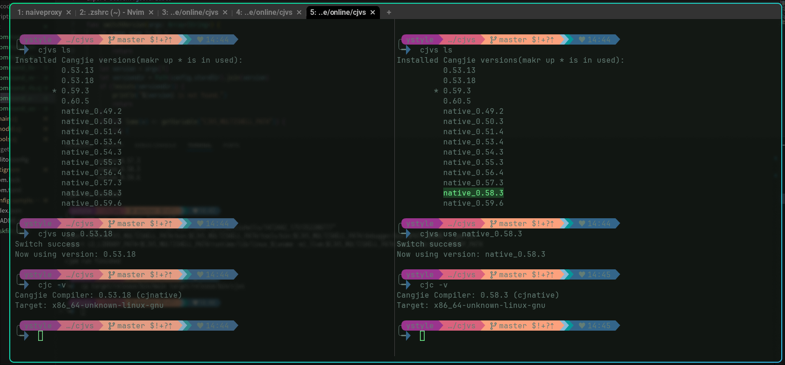

### cjvs
仓颉版本管理工具，类似nvm，目前支持linux、macos、windows平台。解压内建（zip 用 `ystyle::zip`，tar.gz 用 `ystyle::tar` + zlib 流式解压），不依赖系统 `tar` 命令

更新日志:
> - 2026-08-04 v0.4.1 解压改为内建（`ystyle::tar` + zlib 流式解压），不再依赖系统 `tar` 命令；发布包名统一为 `cjvs_v{version}_{platform}.zip`；修复 macOS 构建
> - 2026-07-08 v0.4.0 `cjvs stdx install <version>` 支持在线安装（省略 zip 时从 atomgit 自动下载）；`install`/`stdx` 等命令无需先加载 cjvs 环境即可执行
> - 2026-04-26 v0.3.9 新增 `cjvs rls --beta` 分组显示 beta 版本；版本索引纳入交叉编译/异平台版本（`1.1.0-android`/`-ohos`/`-ios`）；env 模块重构（`cjenv` 函数、`cjvs env -no-ld-library-path`/`-stdx` 选项）
> - 2026-03-24 v0.3.6 升级到 Cangjie 1.1.0, 现在可以直接使用`cjpm install cjvs-0.3.6` 来下载
> - 2025-12-30 v0.3.0 升级到 Cangjie 1.0.0，新增 stdx 管理功能，支持静态/动态库切换，支持 macOS 平台
> - 2025-08-24 windows 也能使用了， 并新增了`elvish`和`nushell`的支持
> - 2025-07-04 因为添加了不同的shell进程，可切换不同版本的功能，当前widnows 版本暂时不可用
> - 2025-03-30 初步支持了windows(powershell), 可以自己手工编译试用


### 功能
- 列出可在线安装的官方发布版本（`cjvs rls`，支持 `sts`/`lts` 频道过滤与 `--beta`）
- 在线安装官方发布版本，包含交叉编译/异平台 SDK（版本号带 `-android`/`-ohos`/`-ios` 后缀）
- 离线安装zip/tar.gz版本(需要按官方的目录结构，可离线安装内测版本)
- 列出已安装的版本
- 在每个shell/或者终端模拟器页签中切换并使用不同的仓颉版本
- 设置默认的仓颉版本
- 删除cjvs安装的版本（正在使用的版本会拒绝删除）
- **管理 stdx 扩展库**：在线安装（atomgit 自动下载）或本地 zip 安装，切换、删除 stdx 版本，支持静态/动态库切换
- **多 Shell 支持**：bash、zsh、fish、nushell、elvish、powershell

### 安装
1. Archlinux
  - 如果使用 `Archlinux` 可以使用 `paru -S cjvs-bin` 安装
  >本仓库 Release 里的 linux-amd64 版本是在 archlinux 构建的，在较老的 linux 发行版可能不支持。
2. Widnows, Linux, MacOS 使用cjpm安装
  - 需要安装 1.1.0+ 版本的 `cangjie编译器` 和 `stdx`，然后设置环境变量: `export CANGJIE_STDX_PATH=path_to_stdx/1.1.0/`
  - 执行`cjpm install cjvs-0.3.6`

### 设置

#### Linux
>linux下默认会安装仓颉版本到`~/.config/cjvs`目录

需要安装[OpenSsl](https://cangjie-lang.cn/docs?url=%2F0.53.18%2Fuser_manual%2Fsource_zh_cn%2FAppendix%2Flinux_toolchain_install.html) ，仓颉网络库依赖openssl

1. 手动安装时需要把cjvs放path环境变量里
  ```shell
  export PATH=$PATH:/path/to/cjvs
  ```
2. 添加shell配置，按使用的bash或zsh添加以下配置
  ```shell
  # zsh
  eval "$(cjvs env zsh)"

  # bash
  eval "$(cjvs env bash)"
 
  # nushell： 这两行
  cjvs env nushell | save -f ~/.cjvs.nu
  use ~/.cjvs.nu
 
  # fish
  cjvs env fish | source
  
  # elvish 
  eval (cjvs.exe env elvish | slurp)
  ```

  > 需要自行管理库搜索路径时，给 `env` 加上 `-no-ld-library-path`（如 `eval "$(cjvs env bash -no-ld-library-path)"`），
  > 选项含义与完整用法见 [env 命令参数](#env-命令参数)；`cjvs env` 或 `cjvs --help` 也会打印用法。


#### Windows
- 编译安装好后，把以下文件放到一个目录，并添加到Path环境变量
  - `cjvs.exe`
  - `libcangjie-runtime.dll`: 来自`$CANGJIE_HOME\runtime\lib\windows_x86_64_llvm\libcangjie-runtime.dll`
  - `libsecurec.dll`: 来自`$CANGJIE_HOME\runtime\lib\windows_x86_64_llvm\libsecurec.dll`
- 找到并打开自己的 PowerShell 启动脚本, 可以执行`$PSVersionTable.PSVersion`查看版本
  - PowerShell 5： `%userprofile%\Documents\WindowsPowerShell\Microsoft.PowerShell_profile.ps1`
  - PowerShell 6/7：`%userprofile%\Documents\PowerShell\Microsoft.PowerShell_profile.ps1`
- 并添加以下内容(创建软件连接需要管理员权限，所以配置成只在有管理员权限时才加载cjvs提供的环境)：
```powershell
# 仅在管理员会话里加载 cjvs
if ([Security.Principal.WindowsPrincipal]::new(
        [Security.Principal.WindowsIdentity]::GetCurrent()
    ).IsInRole([Security.Principal.WindowsBuiltInRole]::Administrator)
) {
    cjvs.exe env powershell | Out-String | Invoke-Expression
}
```
- 以管理员身份启动, 可以正常执行cjvs命令了， 如`cjvs.exe install 1.0.0`

##### 在`非管理员 PowerShell` 使用
- 需要在【设置 - 更新和安全 - 开发者选项 - 开发人员模式】启用， 然后重启系统， 然后在上述文件添加的内容改成只要最后一行添加`cjvs.exe env powershell | Out-String | Invoke-Expression`  
- 如果还提示需要管理员权限， 在【secpol.msc → 本地策略 → 用户权限分配 → 创建符号链接 】添加当前登录用户，再重启系统试试。  
- 如果都不行，就只能回退到上小节，只在管理员会话里加载使用了。

### 配置文件与索引源

首次运行时 cjvs 会自动创建配置文件，保存默认版本、stdx 设置与版本索引地址：

| 平台 | 配置文件位置 |
|---|---|
| Linux / macOS | `~/.config/cjvs/config.json` |
| Windows | `cjvs.exe` 所在目录的 `config.json` |

```json
{
    "default": "1.1.3",
    "stdxDefault": "1.1.3.1",
    "stdxType": "static",
    "index": "https://dll.ystyle.top/images/cjvs-index.json"
}
```

- `default` / `stdxDefault` / `stdxType` 分别对应 `cjvs default`、`cjvs stdx default`、`cjvs stdx config` 写入的内容。
- **`index` 是版本索引地址，可换成自建或镜像源**（`cjvs rls` 与 `cjvs install` 都走它）；
  索引是版本条目数组，每条含 `url`/`ext`/`version`/`os`/`arch`/`channel`，样例见仓库根目录的
  [`config-sample.json`](config-sample.json)（配置样例）与 [`index.json`](index.json)（索引格式）。
- 版本与 stdx 的存放位置固定在配置目录下（`store/`、`stdx/`、`cache/`），不能由配置文件指定。
- 走内网/自签证书的索引源时，可临时用 `NO_VERIFY_SSL=YES` 跳过 TLS 证书校验
  （Windows 平台固定不校验；其它平台默认校验）。
- 只有 `switch`（切换当前 shell 使用的版本）要求该 shell 已加载 cjvs 环境；
  `install`、`stdx`、`list`、`rls` 等在未加载环境的 shell 里也能直接执行
  （此时 `cjvs ls` 不会标出当前正在使用的版本）。
- 删除正在被当前 shell 使用的版本会被拒绝，所以 `remove` 也需要在对应 shell 里执行才有这层保护。

### 使用
```shell
$ cjvs
Usage: cjvs [options...]
  list, ls        List Cangjie installations.
  ls-remote, rls  List all remote Cangjie versions.
                    eg:
                      cjvs rls                                     # List all versions
                      cjvs rls sts                                 # List STS versions only
                      cjvs rls lts                                 # List LTS versions only
                      cjvs rls sts --beta                          # List STS versions with beta
  install, i      Install a new Cangjie version.
                    eg:
                      cjvs install 0.53.13                         # install online
                      cjvs install 1.2.0-ohos                      # install a cross-compile SDK
                      cjvs install 0.59.6 ~/Downloads/cangjie-0.59.6-linux_x64.tar.gz # install a local version
  switch, use     Switch to use the specified version.
  default         Set the default Cangjie version.
  remove, rm      Remove a specific version.
  env             Print and set up required environment variables for cjvs
                    eg:
                      cjvs env zsh                                 # Generate env for zsh
                      cjvs env bash                                # Generate env for bash
                      cjvs env bash -no-ld-library-path            # Generate env without LD_LIBRARY_PATH
                      cjvs env nushell | save -f ~/.cjvs.nu
                    options:
                      -no-ld-library-path  Do not export LD_LIBRARY_PATH (Linux/macOS only)
                      -stdx                Export CANGJIE_STDX_PATH through a symlink;
                                           cjpm cannot read symlinks yet, use 'cjvs stdx-env'
  stdx            Manage stdx (extension library) versions.
                    eg:
                      cjvs stdx list                               # List installed stdx versions
                      cjvs stdx install 1.0.0                      # Install stdx (auto-download)
                      cjvs stdx install 1.0.0 ~/Downloads/stdx.zip # Install from local zip
                      cjvs stdx use 1.0.0                          # Switch stdx version
                      cjvs stdx use 1.0.0 static                   # Switch with static library
                      cjvs stdx default 1.0.0                      # Set default stdx version
                      cjvs stdx default 1.0.0 dynamic              # Set default with dynamic library
                      cjvs stdx config static                      # Set default library type
                      cjvs stdx remove 1.0.0                       # Remove stdx version
                    note:
                      available versions: https://atomgit.com/Cangjie/cangjie_stdx/releases
                      (the online list API needs a token, so cjvs does not list remote versions)
  stdx-env        Generate stdx environment variables for current shell.
                    eg:
                      cjvs stdx-env zsh                            # Generate env for zsh
                      cjvs stdx-env bash                           # Generate env for bash

GLOBAL OPTIONS:
  --help, -h     show help
  --version, -v  print the version
```

示例
- 显示可用版本（`sts` / `lts` 两个频道，用 `cjvs rls sts` / `cjvs rls lts` 可只看其中一个）
  ```shell
  $ cjvs rls sts
  Channel: sts
  	0.53.13
  	0.53.18
  	1.1.0
  	1.1.0-android
  	1.1.0-ohos
  	1.1.3
  	1.1.3-android
  	1.1.3-ohos
  	1.2.0
  	1.2.0-android
  	1.2.0-ohos

  $ cjvs rls lts
  Channel: lts
  	1.0.0
  	1.0.1
  	1.0.3
  	1.0.4
  	1.0.5
  ```
  > 输出随索引与平台变化（如 `-ios` 只在 macOS 上出现），按当前实际输出为准。
- 显示 STS 版本（含 beta，`--beta` 把 beta 单独分组列在稳定版之后）
  ```shell
  $ cjvs rls sts --beta
  Channel: sts
  	0.53.13
  	0.53.18
  	1.1.0
  	1.1.0-android
  	1.1.0-ohos
  	1.1.3
  	1.1.3-android
  	1.1.3-ohos
  	1.2.0
  	1.2.0-android
  	1.2.0-ohos
  	beta:
  		1.1.0-beta.23
  		1.1.0-beta.24
  		1.1.0-beta.25
  ```
- 在线安装版本，第一次安装的版本会被设置为默认版本
  ```shell
  $ cjvs install 0.53.13
  installing 0.53.13...
  install success.
  0.53.13 is set as default version.
  ```
  已安装的版本会提示 `already installed <version>`；索引里查不到的版本提示 `remote version: <version> is not found`。
- 安装交叉编译/异平台 SDK：版本号直接带平台后缀，用法与普通版本完全相同
  ```shell
  $ cjvs install 1.1.3-ohos
  $ cjvs install 1.2.0-android
  $ cjvs install 1.1.3-ios      # 仅 macOS 上可用
  ```
  可用后缀以 `cjvs rls` 的输出为准（`-android` / `-ohos`，macOS 上另有 `-ios`）。
- 安装本地压缩版本（zip/tar.gz的目录结构需要和官方提供的一致）
  ```shell
  $ cjvs install 0.59.6 ~/Downloads/cangjie-0.59.6-linux_x64.tar.gz
  install success.
  ```
- 设置启动shell时默认的版本
  ```shell
  $ cjvs default 0.53.13
  0.53.13 is set as default version.
  ```
- 显示本地已经安装的仓颉版本
    ```shell
    $ cjvs ls
    Installed Cangjie versions(makr up * is in used):
    	  std_0.31.4
    	  jet_0.33.3
    	  std_0.32.5
    	* std_0.33.3
    ``` 
- 切换版本, 可以切换当前shell进程(或终端模拟器的页签)的仓颉版本，每个shell进程可以有不同的版本。
    ```shell
    $ cjvs switch std_0.33.3
    Switch success
    Now using version: std_0.33.3
    ```
    

    > `switch` 只改当前 shell，且要求该 shell 已加载 cjvs 环境（`eval "$(cjvs env bash)"`）；
    > 未加载时会打印 shell 配置指引。目标版本不存在时提示 `<version> is not found.`
- 删除版本:
    ```shell
    $ cjvs rm 0.53.13
    ```
    正在被当前 shell 使用的版本会拒绝删除（`version: 0.53.13 is inused.`），先 `cjvs switch` 到别的版本再删。
- 手动添加版本: 
  - 把仓颉编译器版本复制到`$HOME/.config/cjvs/store`目录
    - 如 `$HOME/.config/cjvs/store/std_0.33.3`， 该目录直接包含`bin、lib、runtime、tools、modules`等目录 
    ```shell
    ~/.config/cjvs$ tree -L 3
    .
    └── store
        └── cangjie_0.33.3
            ├── bin
            ├── debugger
            ├── docs
            ├── envsetup.sh
            ├── lib
            ├── modules
            ├── runtime
            ├── third_party
            └── tools

    10 directories, 1 file
    ```

### stdx 管理

stdx 是仓颉的扩展库，包含预编译的静态库和动态库。cjvs 提供了完整的 stdx 管理功能。

#### stdx 命令

```shell
$ cjvs stdx
Usage: cjvs stdx <list|install|use|default|config|remove|env> [args]
  list, ls                            List installed stdx versions.
  install, i <version> [zip-file]     Install stdx; without zip-file it downloads from atomgit.
  use <version> [static|dynamic]      Switch to use the specified stdx version.
  default <version> [static|dynamic]  Set the default stdx version.
  config <static|dynamic>             Set default library type.
  remove, rm <version>                Remove a specific stdx version.
  env <shell>                         Print CANGJIE_STDX_PATH for the current shell.

  Available versions: https://atomgit.com/Cangjie/cangjie_stdx/releases
  (the online list API needs a token, so cjvs does not list remote versions)
```

- `cjvs stdx list` 列出的是**已安装**的版本，不是可用版本（可用版本见下）。
- `cjvs stdx use/default <version> [static|dynamic]` 同时决定版本与库类型；`config <static|dynamic>` 只改库类型。

#### 在线安装（直接安装）

`cjvs stdx install` 省略 `zip-file` 时会按当前平台从 atomgit 下载并安装，
文件名规则为 `cangjie-stdx-<os>-<arch>-<version>.zip`（`<os>`：`linux` / `mac` / `windows`；
`<arch>`：`x64` / `aarch64`）：

```shell
# 在线直接安装（自动下载当前平台制品）
$ cjvs stdx install 1.1.3.1

# 本地 zip 安装（离线 / 内测版本，目录结构需与官方制品一致）
$ cjvs stdx install 1.1.3.1 ~/Downloads/stdx-1.1.3.1.zip
```

- 第一个安装的 stdx 版本会自动设为默认版本；已安装的版本会直接跳过（`stdx ... is already installed.`）。
- 下载地址可直接拼给浏览器 / curl：
  `https://atomgit.com/Cangjie/cangjie_stdx/releases/download/v<version>/cangjie-stdx-<os>-<arch>-<version>.zip`
- ⚠️ **可用版本列表请到 [atomgit 的 cangjie_stdx releases 页面](https://atomgit.com/Cangjie/cangjie_stdx/releases) 查看**：
  在线列举版本需要 token，cjvs 不请求该接口，因此没有「列远程版本」的子命令，
  请把 atomgit 上的版本号直接传给 `cjvs stdx install <version>`。

#### stdx 使用示例

```shell
# 安装 stdx（在线下载）
$ cjvs stdx install 1.1.3.1

# 安装 stdx（从本地 zip 文件）
$ cjvs stdx install 1.1.3.1 ~/Downloads/stdx-1.1.3.1.zip

# 列出已安装的 stdx 版本（* 表示当前使用的版本，括号内是已安装的库类型）
$ cjvs stdx ls
Installed stdx versions (* = current):
	  1.0.4 (dynamic, static)
	  1.1.0 (dynamic, static)
	* 1.1.3.1 (dynamic, static)
	  1.2.0.1 (dynamic, static)

# 设置默认版本为 1.1.3.1，使用动态库
$ cjvs stdx default 1.1.3.1

# 设置默认版本为 1.1.3.1，使用静态库
$ cjvs stdx default 1.1.3.1 static

# 切换当前版本为 1.1.3.1，使用动态库
$ cjvs stdx use 1.1.3.1

# 只修改默认库类型为 static（不改变版本）
$ cjvs stdx config static

# 删除指定版本
$ cjvs stdx remove 1.0.4
```

#### stdx 落盘位置与 CANGJIE_STDX_PATH

stdx 安装到配置目录下的 `stdx/<version>/`，再按平台、运行时与库类型分层：

```text
~/.config/cjvs/stdx/1.1.3.1/linux_x86_64_cjnative/static/stdx     # 静态库
~/.config/cjvs/stdx/1.1.3.1/linux_x86_64_cjnative/dynamic/stdx    # 动态库
```

- 目录名里的 `<os>_<arch>_<runtime>`：旧版 SDK 是 `linux_x86_64_llvm`，新版是 `linux_x86_64_cjnative`；
  cjvs 先找 `cjnative` 再回退到 `llvm`，两种结构都能识别。
- `cjvs stdx-env <shell>` / `cjvs stdx env <shell>` 输出的 `CANGJIE_STDX_PATH` 指向
  `.../<static|dynamic>/stdx`（即放着 `libstdx.*`、`*.cjo` 的那一层），正好是 cjpm 期望的位置。

#### 在环境中启用 stdx

#### 使用 stdx-env 命令（推荐）

`stdx-env` 命令专门用于设置 stdx 环境变量，直接使用实际路径，不依赖符号链接：

```shell
# bash/zsh
eval "$(cjvs stdx-env zsh)"
eval "$(cjvs stdx-env bash)"

# 或使用子命令形式
eval "$(cjvs stdx env zsh)"

# nushell
cjvs stdx-env nushell | save -f ~/.cjvs-stdx.nu
use ~/.cjvs-stdx.nu

# fish
cjvs stdx-env fish | source

# elvish
eval (cjvs stdx-env elvish | slurp)
```

<details>
<summary>使用 `-stdx` 参数（当前不可用，点击展开）</summary>

> ⚠️ **注意**：由于 cjpm 当前版本不支持读取符号链接，此方式暂不可用。官方已将其作为需求处理，等待修复后可启用。

使用 `-stdx` 参数启用 stdx 环境变量：

```shell
# bash/zsh
eval "$(cjvs env bash -stdx)"

# nushell
cjvs env nushell -stdx | save -f ~/.cjvs.nu
use ~/.cjvs.nu

# elvish
eval (cjvs env elvish -stdx | slurp)
```

这会设置 `CANGJIE_STDX_PATH` 环境变量，指向当前选择的 stdx 版本和库类型（static/dynamic）。

**两种方式的区别**：

- **`cjvs stdx-env <shell>`**：直接使用实际路径，兼容所有版本的 cjpm，**推荐使用**
- **`cjvs env <shell> -stdx`**：使用符号链接，当前 cjpm 版本不支持，暂不可用

</details>

### env 命令参数

`cjvs env` 生成的是交给当前 shell 执行的脚本（`eval "$(cjvs env bash)"` 等），**选项写在 shell 之后**：

```shell
cjvs env <shell> [options]

选项:
  -no-ld-library-path  不自动导出 LD_LIBRARY_PATH
  -stdx                通过符号链接导出 CANGJIE_STDX_PATH（当前不可用，见下）
```

- **默认行为**：把当前 `$CANGJIE_HOME` 的运行时库路径追加到已有 `LD_LIBRARY_PATH` 之前，依次为
  `runtime/lib/<os>_$(uname -m)_llvm`、`runtime/lib/<os>_$(uname -m)_cjnative`、`lib/<os>_x86_64_jet`、
  `tools/lib`、`debugger/third_party/lldb/lib`；同时设置 `CJVS_MULTISHELL_PATH`、`CANGJIE_HOME` 与 `PATH`。
- **`-no-ld-library-path`**：只跳过上面那一步自动导出，其余环境变量照常设置。
  适合自己管理库搜索路径的场景（系统里已有同名的仓颉运行时库、由容器镜像统一注入、或改用 `RPATH` 等）。
  注意脚本里仍会定义 `cjenv` 函数（**手动执行才生效**），要完全不碰 `LD_LIBRARY_PATH` 就不要调用它。
- **`-stdx`**：用符号链接导出的 `CANGJIE_STDX_PATH` 当前不被 cjpm 支持，请改用 `cjvs stdx-env <shell>`。
- 支持的 shell：Unix 为 bash、zsh、fish、nushell、elvish，Windows 为 powershell、nushell、fish、elvish。
  Windows 不使用 `LD_LIBRARY_PATH`，因此没有 `-no-ld-library-path`。
- 不写 shell、或把选项写在 shell 之前（如 `cjvs env -no-ld-library-path bash`）会打印用法，选项不会生效。

#### 使用示例

```shell
# 基础用法
eval "$(cjvs env bash)"

# 不自动设置 LD_LIBRARY_PATH（某些情况下可能需要）
eval "$(cjvs env bash -no-ld-library-path)"

# 查看可用选项
cjvs env
```

#### cjenv 快捷函数

bash/zsh 和 elvish 会自动定义 `cjenv` 函数，用于快速设置库路径：

```shell
# 在 shell 中手动调用 cjenv 更新库路径
cjenv
```

这会更新 `LD_LIBRARY_PATH` 指向当前 `$CANGJIE_HOME` 的运行时库路径。

该函数**调用时才生效**，所以启用 `-no-ld-library-path` 时它不会在加载阶段改动 `LD_LIBRARY_PATH`；不需要它就不要调用。

### 许可证
[MIT License](LICENSE)
